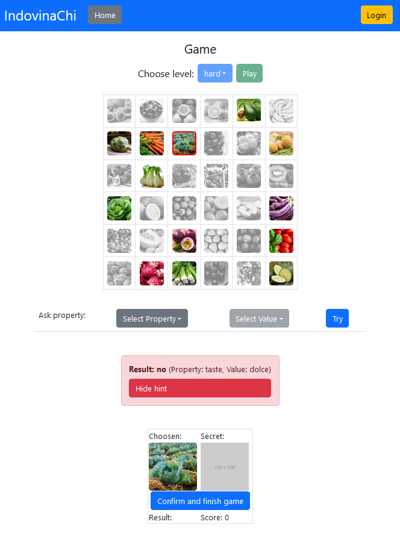

# GuessWhoGame
## Author: DI STASIO DOMENICO 

## WARNING: TO RUN THIS PROJECT FOLLOW THE INSTRUCTION
- Install NodeJS
- Install NPM

- Go in Client
- npm install
- Go in Server
- npm install

- Go in Client 
- npm run dev
- Go in Server
- node index.js

## React Client Application Routes

- Route `/`: pagina principale che contiene il gioco
- Route `/history`: pagina autenticata che mostra la lista delle partite giocate da un utente
- Route `/login`: pagina che mostra un form per effettuare il login
- Route `*`: per tutte le pagine che non esistono

## API Server
### Autenticazione
- POST `/sessions` : Login
  - request parameters and request body content: Username e Password
  - response body content: Utente autenticato
- GET `/sessions/current` : Check if user is logged in
  - request parameters and request body content: Nessuno
  - response body content: Ritorna l'utente autenticato
- DELETE `/sessions/current` : Logout
  - request parameters and request body content: Nessuno

### Dati
- GET `/api/games` : History
  - Autenticata
  - request parameters and request body content: Nessuno
  - response body content: Ritorna la lista delle giocate dell'utente autenticato
- PUT `/api/games` : Salvataggio punteggio partita
  - request parameters and request body content: Id della partita corrente, Punteggio ottenuto, Oggetto segreto
  - response body content: Ritorna il numero di righe aggiornate
- POST `/api/games` : Creazione di una nuova partita
  - Non autenticata
  - request parameters and request body content: Livello di difficoltà e lista degli oggetti del gioco (già selezionati per livello)
  - response body content: Ritorna il gameId della partita creata
- GET `/api/fruits/<level>` : Lista degli oggetti del gioco (in base al livello)
  - Non autenticata
  - request parameters and request body content: Livello di difficoltà scelto dall'utente
  - response body content: Ritorna gli oggetti del gioco in base al livello
- GET `/api/attempts/<gameId>/<property>/<value>`
  - Non autenticata
  - request parameters and request body content: Id della partita corrente, proprietà e valore relativi al tentativo
  - response body content: Ritorna "hint=yes" o "hint=no" sulla base della correttezza del tentativo
- GET `/api/secrets/<gameId>` : Oggetto segreto
  - Non autenticata
  - request parameters and request body content: Id della partita corrente
  - response body content: Ritorna id e nome dell'oggetto segreto relativo alla partita identificata dal gameId

## Database Tables

- Table `users` - (id, email, name, hash, salt)
- Table `games` - (id, user, date, score, secretObject, level, completed)
- Table `objects` - (id, name, type, color, season, taste, seeds, tree, peel, juice, img)

## Main React Components

- `GameComponent` (in `GameComponents.jsx`): racchiude i contenuti della pagina di gioco
- `TryComponent` (in `TryComponents.jsx`): componente per effettuare tentativi
- `EndComponent` (in `EndComponents.jsx`): componente per terminare la partita
- `History` (in `History.jsx`): racchiude i contenuti della pagina history
- `NavHeader` (in `NavbarComponents.jsx`): header dell'app

## Screenshot

## Users Credentials

Here you can find a list of the users already registered inside the provided database.

|     email       |   name   | plain-text password |
|-----------------|----------|---------------------|
| j.d@polito.it   | John     | password            |
| m.r@polito.it   | Mario    | password            |
| test@polito.it  | Testuser | password            |

